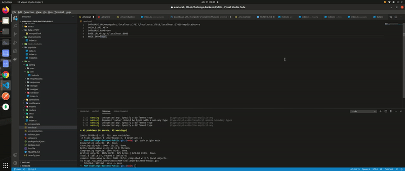
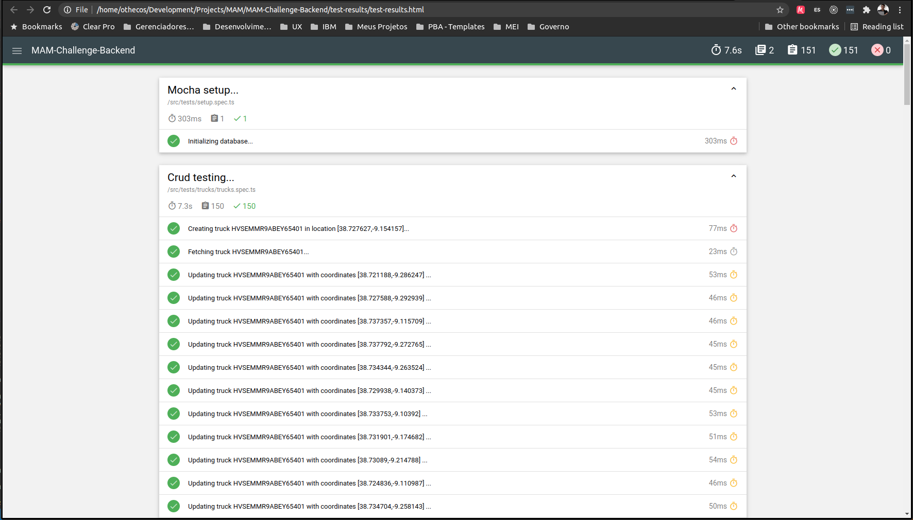
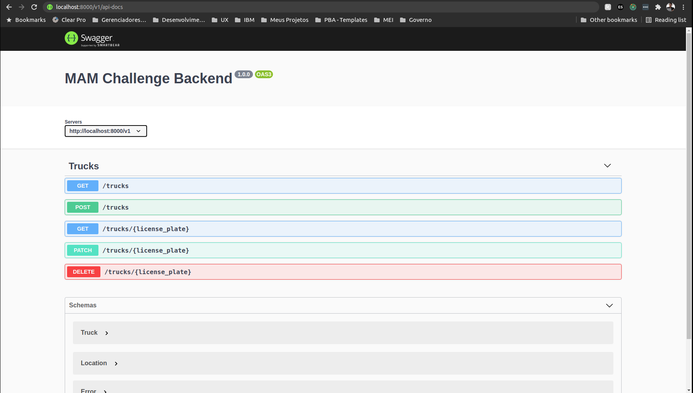
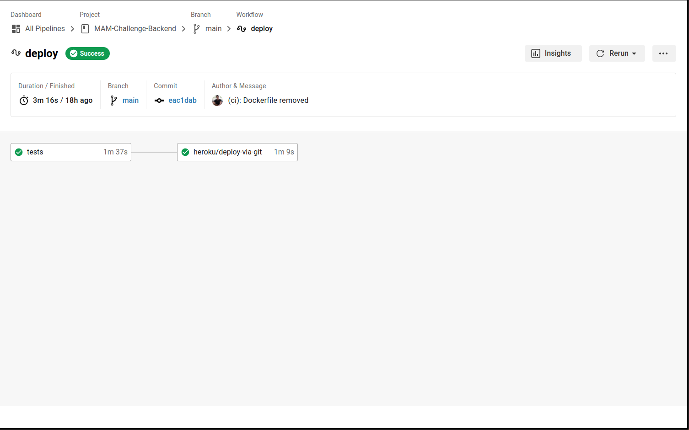

<!-- PROJECT LOGO -->
<br />
<p align="center">

  <h3 align="center">MAM - Challenge Back-End (Node.js)</h3>

  <p align="center">
    This is an Node.Js Restful API build with Typescript to provide Data about trucks in Lisbon City
    <br />
     <a href="https://mam-challenge-front-end.vercel.app/"><strong>Check the demo</strong></a>
    ·
   <a href="https://github.com/othecos/MAM-Challenge-Front-End">View Front-End</a>
  </p>
</p>

<!-- TABLE OF CONTENTS -->
<details open="open">
  <summary>Table of Contents</summary>
  <ol>
    <li>
      <a href="#about-the-project">About The Project</a>
      <ul>
        <li><a href="#built-with">Built With</a></li>
      </ul>
    </li>
    <li>
      <a href="#getting-started">Getting Started</a>
      <ul>
        <li><a href="#prerequisites">Prerequisites</a></li>
        <li><a href="#installation">Initiating database</a></li>
        <li><a href="#installation">Installation</a></li>
        <li><a href="#populating">Populating Database</a></li>
      </ul>
    </li>
    <li><a href="#usage">Usage</a></li>
    <li><a href="#testing">Testing</a></li>
    <li><a href="#documentation-swagger">Documentation (Swagger)</a></li>
    <li><a href="#cicd-circleciheroku">CI/CD(CircleCi+Heroku)</a></li>
  </ol>
</details>

<!-- ABOUT THE PROJECT -->

## About The Project

This project was build with the purpose to serve as an API for the MAM Challenge. This serve contains routes that can be use to create trucks, retrieve data information such as license_plate, current location and history of locations the truck has walked through and to update trucks location.

Just to remind that this is <strong>NOT</strong> a <strong>PRODUCTION</strong> ready project, and some security issues should be consider if used in Production environment

This project has it's CI/CD pipeline hosted on Circle CI and it's deploy service hosted on Heroku.

After the production code is pushed to the `main` branch, it starts to jobs described on `.circleci/config.yaml` file, running the build, test and deploy jobs.

### Built With

-   [Node.Js](https://nodejs.org/)
-   [MongoDB](https://www.mongodb.com/)
-   [Mongoose](https://mongoosejs.com/)
-   [Express](https://expressjs.com/)
-   [Joi](https://joi.dev/)
-   [Swagger](https://swagger.io/)
-   [Typescript](https://www.typescriptlang.org/)
-   [Faker](https://github.com/marak/Faker.js/)
-   [Mocha](https://mochajs.org/)
-   [Chai](https://www.chaijs.com/)
-   [CircleCI](https://circleci.com/)
-   [Heroku](https://www.heroku.com/)
-   [Run-rs](https://www.npmjs.com/package/run-rs)

<!-- GETTING STARTED -->

## Getting Started

That is three main environments that you can simulate in this project:

-   local
-   test
-   production

You can configure `variables` for each one of the environments in the `.env.(environment)`

### Prerequisites

You should have <strong>Node, and NPM and (MongoDB or Run-rs) </strong> installed to run this project.

To check with you have those installed, run and see some similar output:

-   NPM
    ```sh
    npm -v
    6.14.4
    ```
-   Node
    ```sh
    node -v
    v10.19.0
    ```
-   MongoDB

    ```sh
    mongo --version
    MongoDB shell version v4.4.5
    Build Info: {
        "version": "4.4.5",
        "gitVersion": "ff5cb77101b052fa02da43b8538093486cf9b3f7",
        "openSSLVersion": "OpenSSL 1.1.1f  31 Mar 2020",
        "modules": [],
        "allocator": "tcmalloc",
        "environment": {
            "distmod": "ubuntu2004",
            "distarch": "x86_64",
            "target_arch": "x86_64"
        }
    }
    ```

    Run-rs

    ```sh
    run-rs --helṕ
    Usage: run-rs [options]

    Options:

        -v, --version [version]  Version to use
        -k, --keep               Use this flag to skip clearing the database on startup
        -s, --shell              Use this flag to automatically open up a MongoDB shell when the replica set is started
        -q, --quiet              Use this flag to suppress any output after starting
        -m, --mongod [string]    Skip downloading MongoDB and use this executable. If blank, just uses `mongod`. For instance, `run-rs --mongod` is equivalent to `run-rs --mongod mongod`
        -n, --number [num]       Number of mongods in the replica set. 3 by default.
        -p, --portStart [num]    Start binding mongods contiguously from this port. 27017 by default.
        -d, --dbpath [string]    Specify a path for mongod to use as a data directory. `./data` by default.
        -h, --host [string]      Override the default ip binding and bind mongodb to listen to other ip addresses. Bind to localhost or 127.0.0.1 by default
        -l, --linux [string]     Override the default system linux. Only for linux version. `ubuntu1604` by default
        -p, --bind_ip_all        Allow connections from remote servers, not just from localhost.
        --help                   Output help
    ```

### Initiating database

1.  If you have `run-rs` installed on your machine, just run:
    ```sh
    run-rs -v 4.0.0
    ```
2.  Otherwise, install it first and run the first command again:
    ```sh
    npm install run-rs -g
    ```
3.  You should see the result below:

    ```sh
    Purging database...
    Running '/usr/local/lib/node_modules/run-rs/4.0.0/mongod' [ 27017, 27018, 27019 ]
    Starting replica set...
    Started replica set on "mongodb://localhost:27017,localhost:27018,localhost:27019?replicaSet=rs"
    Connected to oplog

    ```

4.  If you see a result like this

    ```sh
    Purging database...
    rm: cannot remove '/home/othecos/Development/Projects/MAM/data/27017/_mdb_catalog.wt': Permission denied
    rm: cannot remove '/home/othecos/Development/Projects/MAM/data/27017/collection-2-3069966935063505429.wt': Permission denied
    rm: cannot remove '/home/othecos/Development/Projects/MAM/data/27017/storage.bson': Permission denied
    rm: cannot remove '/home/othecos/Development/Projects/MAM/data/27017/index-5-3069966935063505429.wt': Permission denied
    rm: cannot remove '/home/othecos/Development/Projects/MAM/data/27017/diagnostic.data': Permission denied
    rm: cannot remove '/home/othecos/Development/Projects/MAM/data/27017/WiredTiger.turtle': Permission denied
    rm: cannot remove '/home/othecos/Development/Projects/MAM/data/27017/collection-11-3069966935063505429.wt': Permission denied
    rm: cannot remove '/home/othecos/Development/Projects/MAM/data/27017/WiredTiger.lock': Permission denied
    rm: cannot remove '/home/othecos/Development/Projects/MAM/data/27017/collection-0-3069966935063505429.wt': Permission denied
    rm: cannot remove '/home/othecos/Development/Projects/MAM/data/27017/mongod.lock': Permission denied
    rm: cannot remove '/home/othecos/Development/Projects/MAM/data/27017/index-12-3069966935063505429.wt': Permission denied

    ```

5.  Run the 1 command with `sudo`:
    ```sh
      sudo run-rs -v 4.0.0
    ```

### Installation

1. Install the NPM Packages dependencies
    ```sh
     npm install
    ```

### Populating database

1. The populate service uses Google Maps Directions to simulate a route that a trucker would do in real world. 
Because of that, **a Google API KEY** is **required**.

    You can generate this API KEY [here](https://developers.google.com/maps/documentation/javascript/get-api-key) and after you need to added in the desired environment

    

2. Choose the environment you want to populate, `local` or `prod` and run `npm run pre{environment}`

    ```sh
     npm run prelocal
    ```

    or

    ```sh
     npm run preprod
    ```

    This command will generate an `.env` file with the environment variables

2. Now, you can run the populate command to insert 20 trucks in the database with multiple GPS Coordinates already set it.
    ```sh
     npm run populate
    ```

## Usage

After the initial setup, you are ready to go and can start your development server

1. To use your local environment, run:

```sh
   npm run local
```

2. To use prod environment, run:

```sh
   npm run prod
```

<!-- ROADMAP -->

## Testing

To run the unit tests, just run the following command:
```sh
   npm run test
```
It will create a folder, due to `mocha-awesome`, that contains all the latest tests runned.

 

## Documentation (Swagger)

You can see the API documentation on the `/v1/api-docs` route

 

## CI/CD (CircleCi+Heroku)

There is a configuration file in the path `.circleci/config.yml` that is used to deploy this code to CircleCi, test and deploy it to Heroku.

If you would like, you can create an account in CircleCi and github to test this pipeline!

 ***Obs:. You should create environment variables in the Circle CI and Heroku to make it work, since the .env files aren't upload to Github***

 